# Gilt

A dark Omarchy theme of cool obsidian, warm parchment, sovereign gold, and restrained jewel tones.

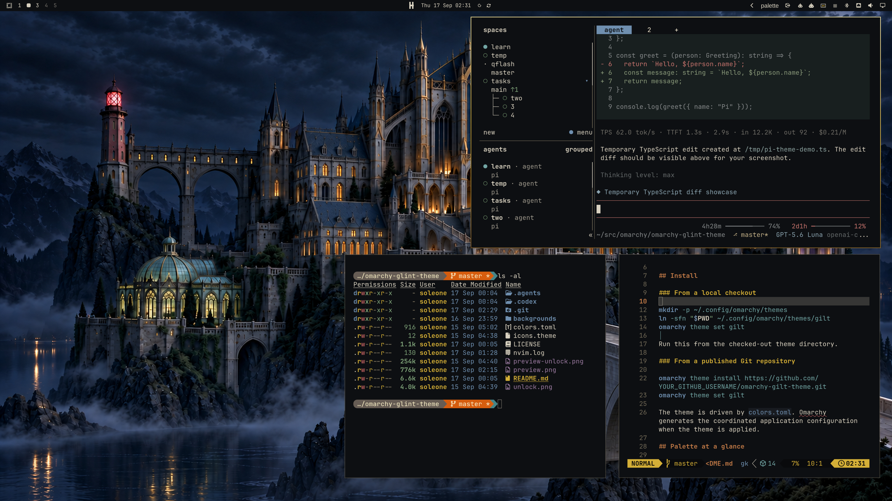

Black stone and charcoal architecture, with parchment and ivory lettering kept clear against the dark. Accented by gold metalwork, with copper, jade, verdigris, lapis, amethyst, and bronze as quieter selective touches.

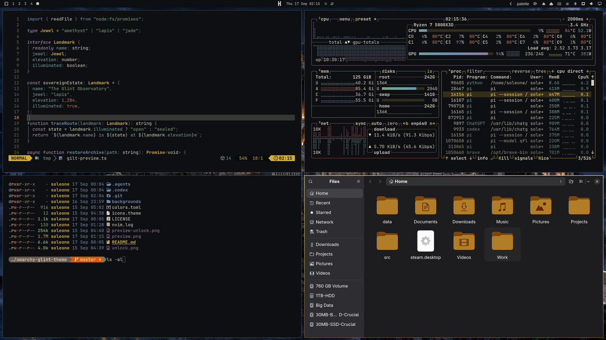

## Install

```bash
omarchy theme install https://github.com/Soleone/omarchy-gilt-theme.git
```

## Palette at a glance

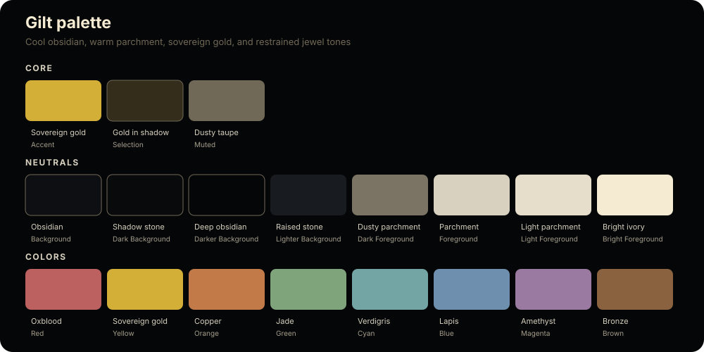

| Material | Hex | Role |
| --- | --- | --- |
| Obsidian | `#0D0F12` | Main desktop and application background |
| Deep obsidian | `#050607` | Deepest background and recesses |
| Raised stone | `#181B20` | Raised panels and lighter surfaces |
| Parchment | `#D8D1C0` | Primary text |
| Light parchment | `#E6DECB` | Raised and secondary emphasis |
| Bright ivory | `#F5EBD2` | Cursor, high emphasis, selected text |
| Dusty taupe | `#716957` | Comments, dividers, muted UI |
| Sovereign gold | `#D4AF37` | Focus, links, borders, active states |
| Gold in shadow | `#342D1B` | Selection background and low gold surfaces |
| Oxblood | `#BC6060` | Errors and urgent states |
| Copper | `#C27B48` | Numbers, changes, and warm contrast |
| Jade | `#7FA37A` | Strings and success states |
| Verdigris | `#72A5A4` | Parameters and cool contrast |
| Lapis | `#6F8FAF` | Functions and navigation |
| Amethyst | `#9A7AA0` | Keywords and structural emphasis |
| Bronze | `#8A6240` | Supporting earth tone and metal detail |

## Wallpapers

The first wallpaper is the default. The six alternatives follow the order in which they were created in the active Gilt setup, from oldest to newest. Every wallpaper is a 3840 × 2160 JPEG and can be cycled with `Super + Ctrl + Space` or `omarchy theme bg next`.

<details>
<summary>Open the wallpaper gallery</summary>

<table>
<tr>
<td>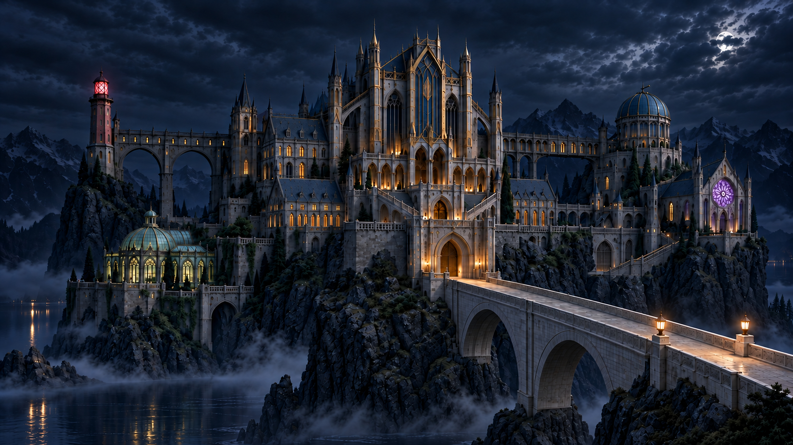</td>
<td>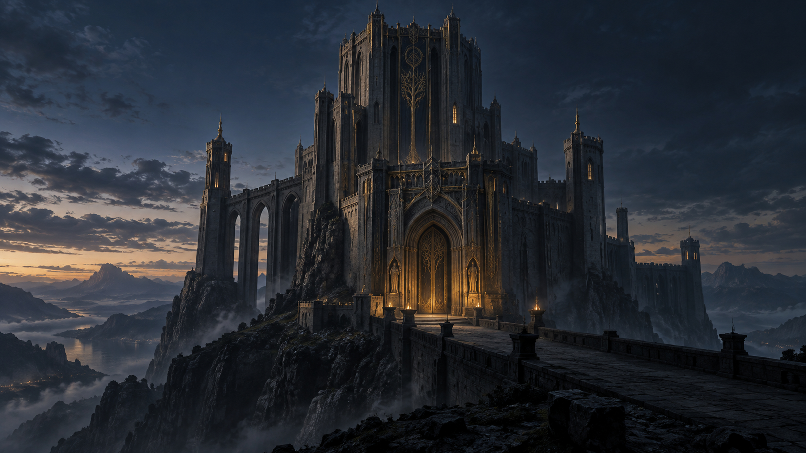</td>
</tr>
<tr>
<td>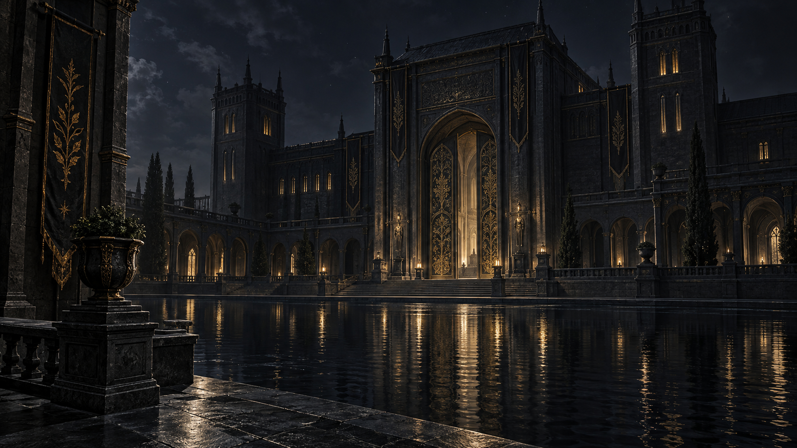</td>
<td>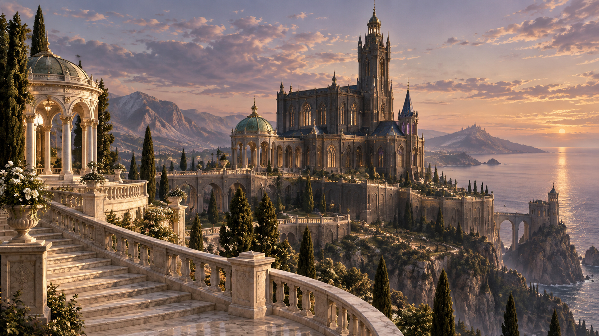</td>
</tr>
<tr>
<td>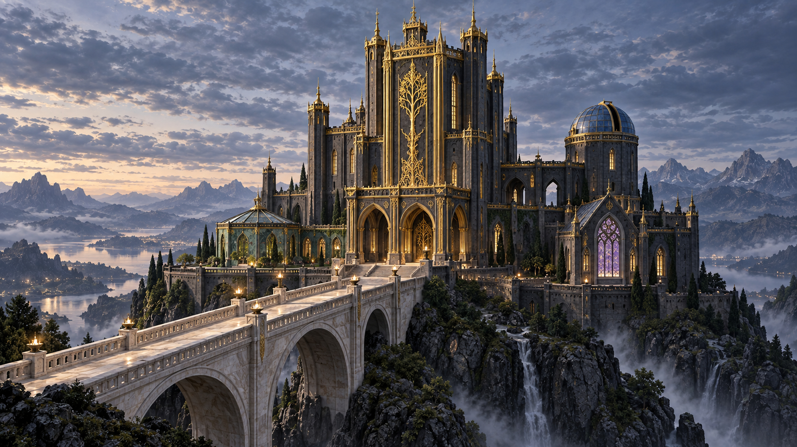</td>
<td>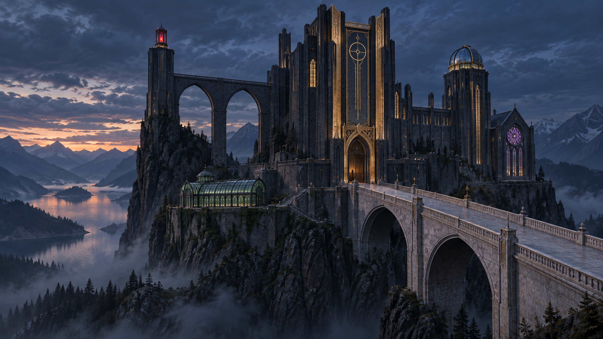</td>
</tr>
<tr>
<td>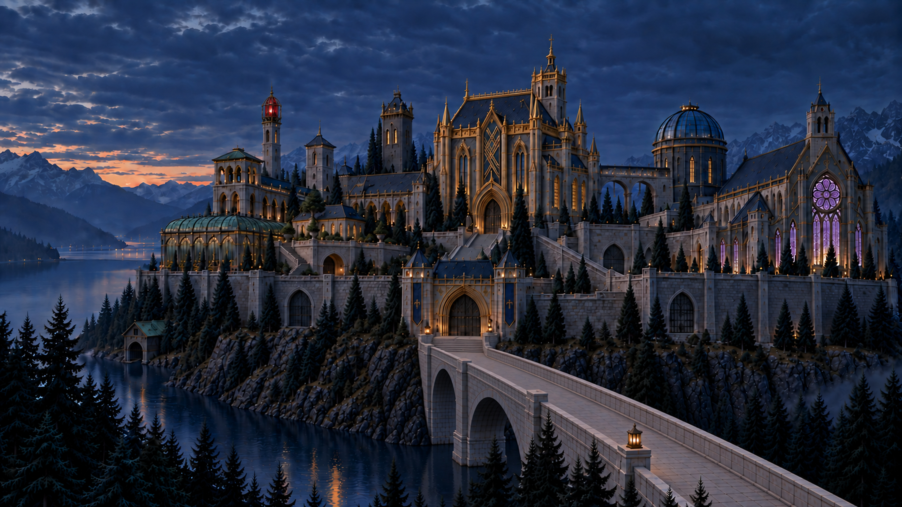</td>
<td></td>
</tr>
</table>

</details>

| Slot | File | Character |
| --- | --- | --- |
| 01 | [`sovereign-estate`](backgrounds/01-sovereign-estate.jpg) | The primary estate: a moonlit high palace, bridge, lake, and mountain court |
| 02 | [`oratory-01`](backgrounds/02-oratory-01.jpg) | A solitary dark keep above the evening valley |
| 03 | [`oratory-02`](backgrounds/03-oratory-02.jpg) | A quiet reflecting court beside still water |
| 04 | [`oratory-03`](backgrounds/04-oratory-03.jpg) | A pale marble approach in open evening light |
| 05 | [`oratory-04`](backgrounds/05-oratory-04.jpg) | A bright elevated view of the gilded estate |
| 06 | [`oratory-05`](backgrounds/06-oratory-05.jpg) | The red watchtower and bridge at blue hour |
| 07 | [`oratory-06`](backgrounds/07-oratory-06.jpg) | A wide final view of the estate across the lake |

## Unlock screen

Gilt includes a matching unlock screen.

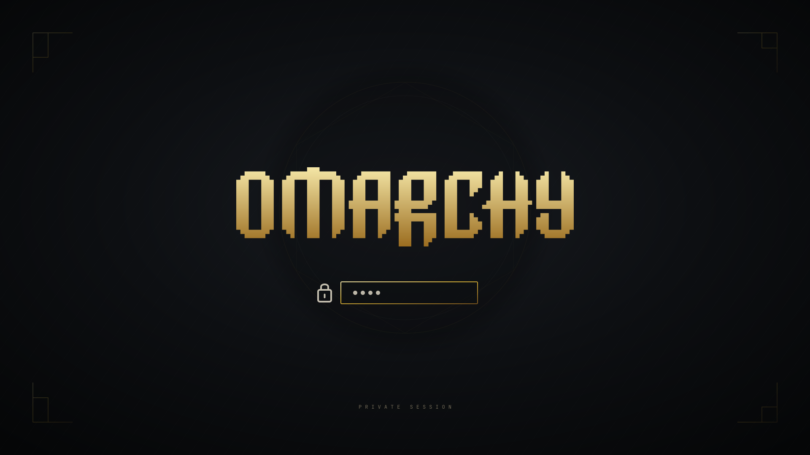

## Customize

Double-click your current wallpaper to open the wallpaper selector.

Edit the palette in `colors.toml`, then reapply it:

```bash
omarchy theme refresh
```

## License

Gilt is released under the [MIT License](LICENSE).
